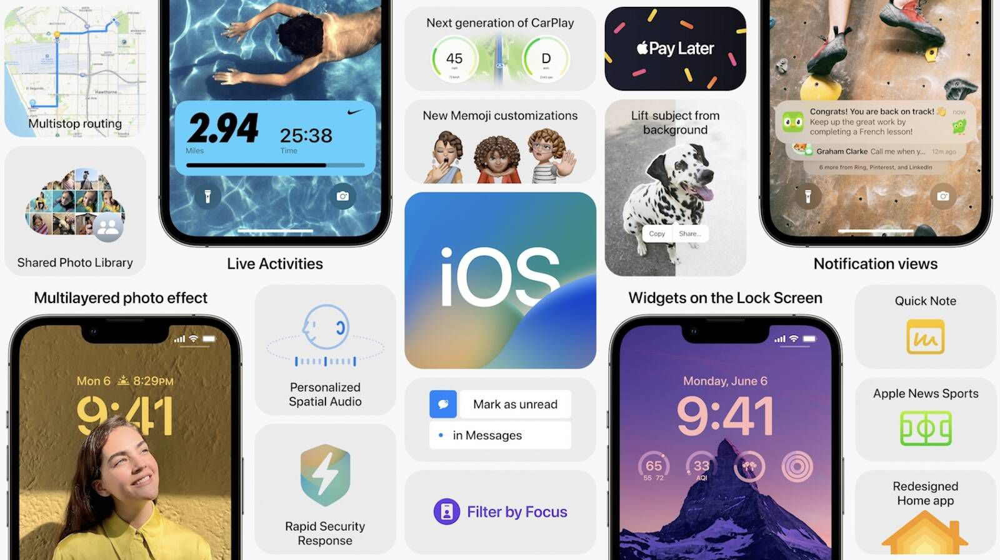

**WWDC22 Keynotes sweet summery**

WWDC is Major Apple event held every year, here is the summery of all mejojr announcement they made at WWDC22.

**iOS 16**

* All new customised **Lock** Screen, with widgets and Live Activities support.
* Apple announce **Apple Pay Later**, which will support  4 equal instalments with 
zero interest and no fees.
* **iCloud share** photo library allow users to share photos with five other users, 
using select photo, date range or can choose automatic to share with the users 
in the photo.
* **Messages** have ability to edit, undo send, allowing users to recall the messages, 
Email allow users to schedule emails, undo send, remind to attach attachment.
* **Parental control** allow users to setup kids device, kids can now request more 
screen time on Messages from Parents.
* **Apple Map** now support multi stop route, user will get transit update for public 
transport routs, including travel coast and transit card support in Apple Wallet. 
Apple support look around now (just like street view).

**Watch OS 9**
* Added new running metrics, including vertical oscillation, stride length and 
ground contact time.
* **Fitness app** in iOS now will be enabled without apple watch, so users without 
apple watch can close the rings.
* **Workouts** now have hart rate zones, so you can see how hard you’re 
exercising.
* The **Sleep app** will now have Sleep Stages, a feature that uses signals from 
your watch's accelerometer to figure out what sleep stage you're in, and how 
long you've spent in each stage.
* Apple Watch will be able to track your “A-fib history” to help doctors monitor 
heart arrhythmia and determine if treatment is helping.
* Also added feature to track and manage medication.

**M2**
* The second generation of Apple silicon M2 is 18% better performer, while the 
GPU is 35% faster.
* Apple announce new **Macbook Air** with M2, with improved built-in camera 
(1080p) and improved low light performance with TouchID.
* **Macbook Pro** is getting M2, with CPU gains up to 40% over M1 Macbook Pro.

**macOS Ventura**
* **Stage Manager** is coming to macOS, now you can group running apps together, 
so while click on a group it will be in focused and other apps will be minimised.
* **Mail App** is getting support for undo send, schedule send and timed reminders.
* **Safari** will now be able to use passkeys instead of passwords.
* Apple’s game-development focused API **Metal** is upgrading with upscaling and 
faster resource loading.
* A very cool feature **Continuity Camera** is introduced, now you can use your 
iPhone camera for video calls on macOS. Desk View allow you capture what 
you are doing on your desk using iPhone’s wide angle lens.

**iPadOS 16**
* iPasOS will also get **Stage Manager** feature to group task related apps together, 
only those apps will be in focus while selecting the group.
* Share photo library, share safari tab groups like features from iOS will be in 
iPadOS as well.
* Introduced **Weather App** to iPad with coon animations, for developers 
WeatherKit is introduced to integrate weather in their apps.
* **Collaboration** feature to collaborate with  team using Pages, Safari tab groups, 
notes and keynotes.
* post3Freeform , Desktop-class apps are new added apps for iPad.